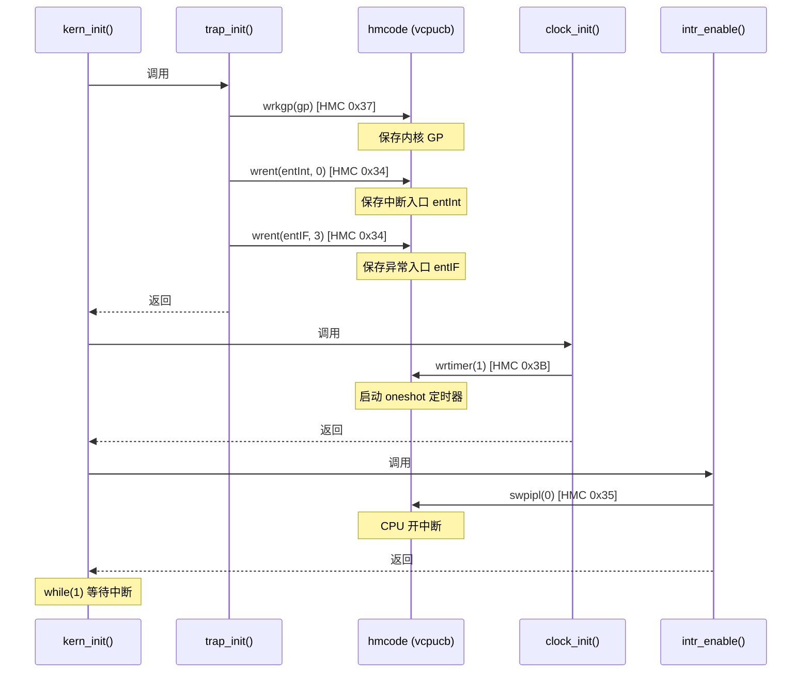
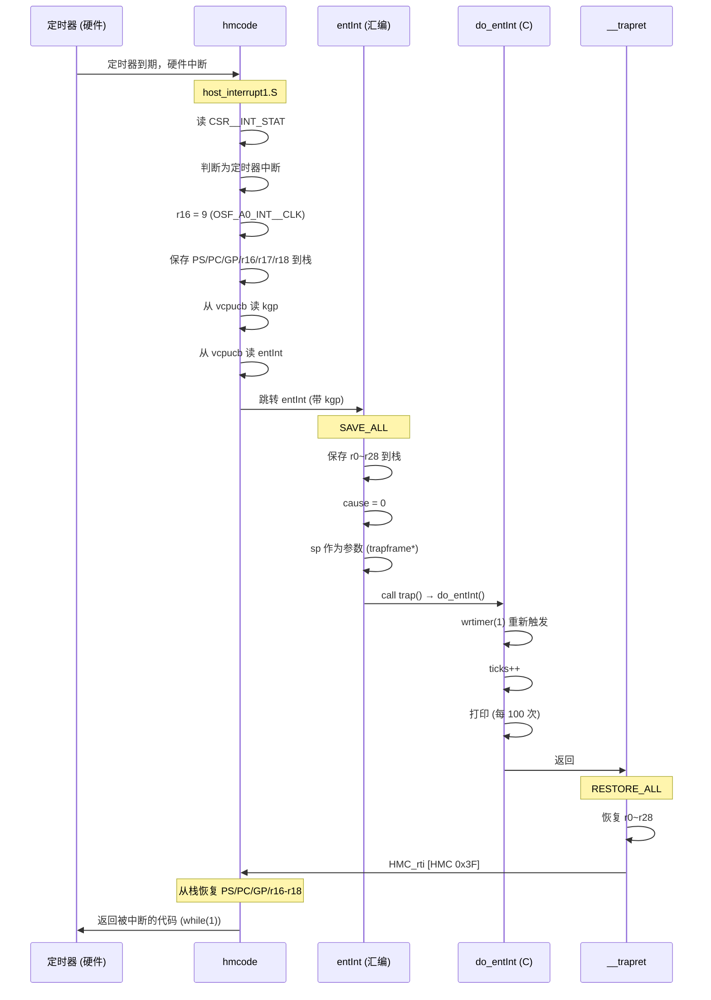
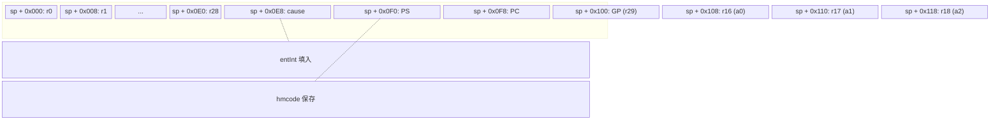
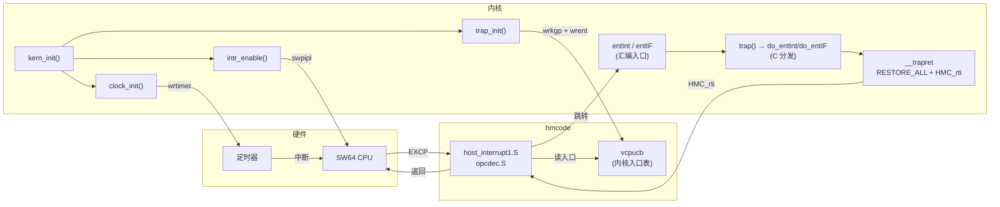

# Lab1 中断处理流程

## 1. 中断注册流程



## 2. 中断发生与处理流程



## 3. 异常处理流程

```mermaid
flowchart TD
    subgraph 断点异常
        A1["sys_call 0x80 (HMC_bpt)"] --> B1["hmcode 识别"]
        B1 --> C1["r16 = 0 (IF_BREAKPOINT)"]
        C1 --> D1["entIF"]
    end

    subgraph 非法指令异常
        A2[".long 0x7a000000"] --> B2["CPU 解码失败"]
        B2 --> C2["QEMU: EXCP_OPCDEC"]
        C2 --> D2["hmcode opcdec.S"]
        D2 --> E2["r16 = 4 (IF_OPDEC)"]
        E2 --> D1
    end

    D1 --> F["SAVE_ALL (r0~r28)"]
    F --> G["cause = 3"]
    G --> H["trap(tf)"]
    H --> I{cause == 0?}
    I -->|否| J["do_entIF(tf)"]
    J --> K{a0 (r16) = ?}

    K -->|0| L["断点<br/>打印 PC-4<br/>不需要 +4"]
    K -->|4| M["非法指令<br/>打印 PC<br/>PC += 4 跳过"]

    L --> N["__trapret"]
    M --> N
    N --> O["RESTORE_ALL"]
    O --> P["HMC_rti (0x3F)"]
    P --> Q["返回执行"]
```

## 4. 栈上寄存器布局



## 5. 整体架构


